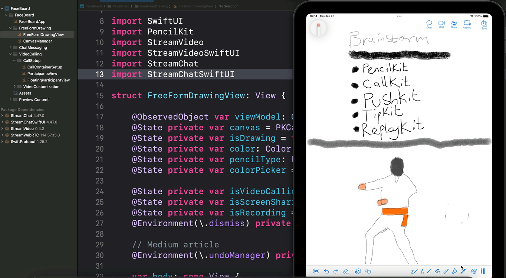
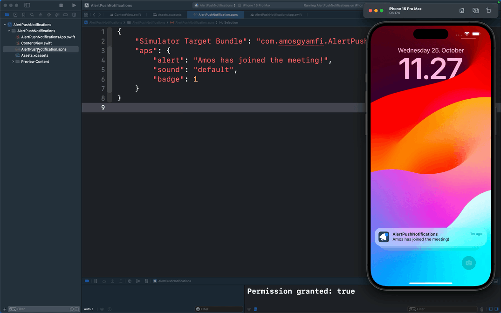

## Stream Developers [iOS/SwiftUI](https://youtube.com/playlist?list=PLNBhvhkAJG6tJYnY-5oZ1JCp2fBNbVL_6), [Android/Compose](https://youtube.com/playlist?list=PLNBhvhkAJG6tbp6aGqQ81gU4VdARMWsin&si=7RKmg4em4HSBY-I8), and [React Native](https://youtube.com/playlist?list=PLNBhvhkAJG6u7ewQJPQMuIZBAfIAsA5RY&si=hSoX1fdBsBLG3vp6) Tutorial Projects.

- [iOS Swift SDK for chat messaging](https://getstream.io/chat/sdk/ios/)
- [React Native Chat SDK: https://getstream.io/chat/sdk/react-native/](https://getstream.io/chat/sdk/react-native/)
- [Android Chat SDK](https://getstream.io/chat/sdk/android/)

You can find the projects in their respective folders. 

## [SwiftUI Telegram Clone](TelegramClone): Text/voice messaging, audio/video calling, and animations

---

## visionOS Drawing App

---

## PencilKit SwiftUI Drawing App

---

## Building Fun SwiftUI Animations
Watch the tutorial on [YouTube](https://www.youtube.com/playlist?list=PLNBhvhkAJG6tJYnY-5oZ1JCp2fBNbVL_6)

---

## Test and send iOS push notifications in a SwiftUI or UIKit app using the simulator: [SwiftUI Project](https://github.com/GetStream/swift-and-swiftui-tutorial-projects/tree/main/AlertPushNotifications)

---

